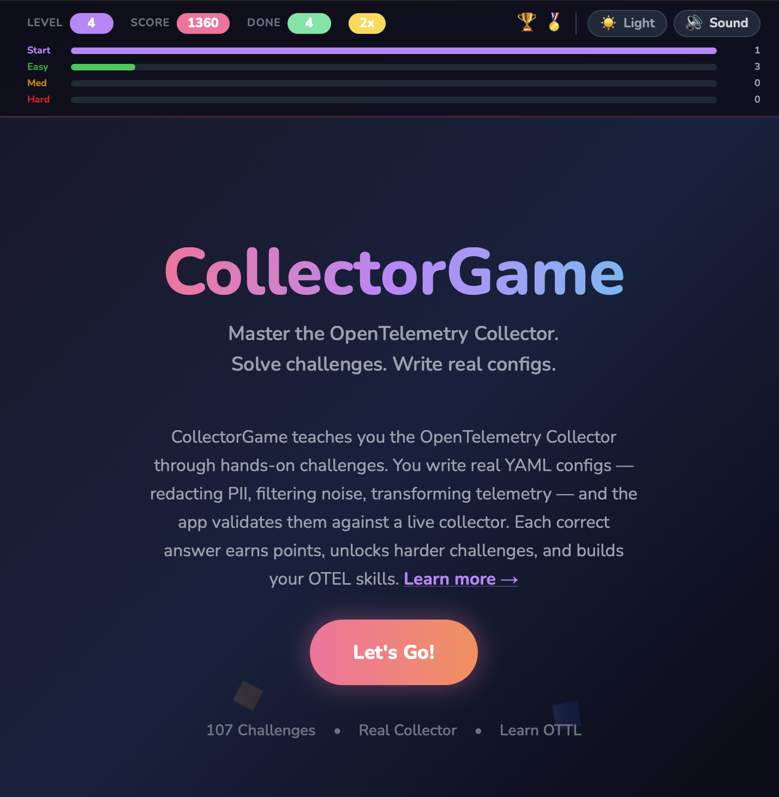

# OpenTelemetry Collector Game

## Try it here: https://collectorgame.agardner.net

Learn the OpenTelemetry Collector with a game!

107 (and counting) scenarios covering receivers, processors, exporters and all signal types.

This app is an easy way to learn concepts and configurations for the OpenTelemetry Collector via a game.

## Features

- Scoring (stored locally in browser)
- Levels
- Rewards
- Light and dark mode
- Extensible (add your own scenarios)
